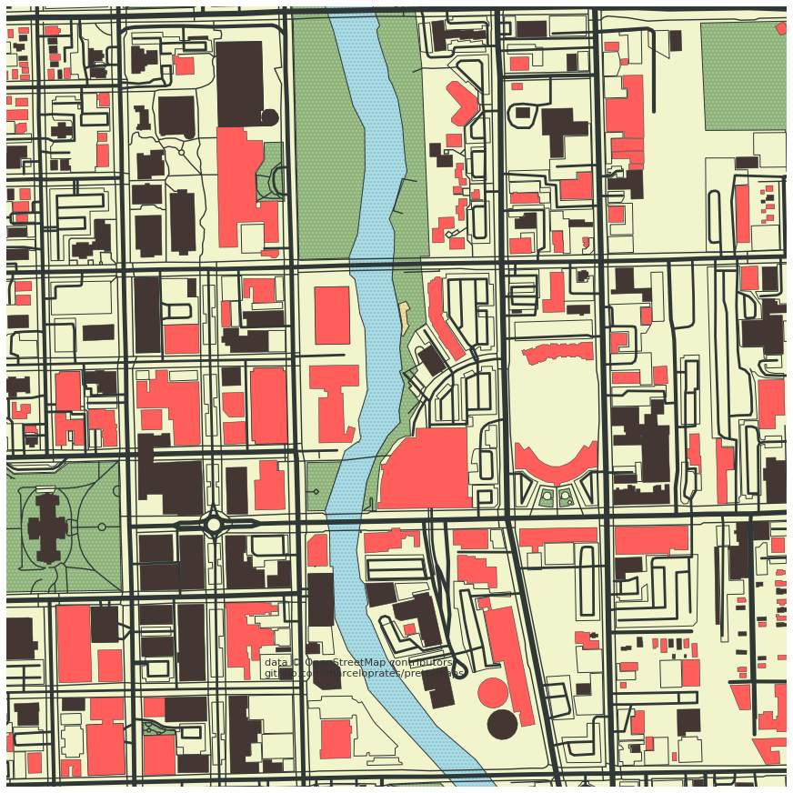
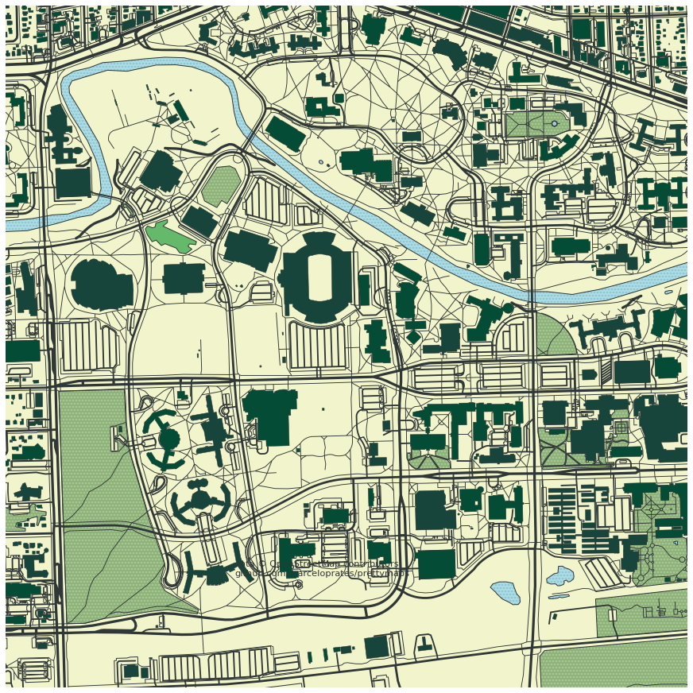
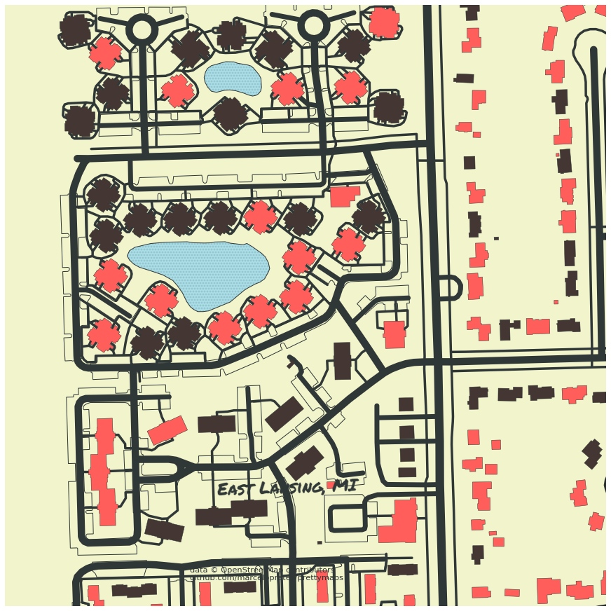

# PrettyMaps_playground

## All images created created using PrettyMaps by marceloprates

## Map Data provided by Open Maps

#### Github: [prettymaps](https://github.com/marceloprates/prettymaps)

#### Akers & Fell Halls at Michigan State University

#### Lansing, Michigan centered on the capital building

#### Lansing, Michigan Downtown/Stadium District

#### Michigan State University Campus (centered on Spartan Stadium, in school colors)

#### Lansing, Michigan (Confluence of Red Cedar & Grand Rivers)

#### East Lansing, Michigan Apartment Complex
